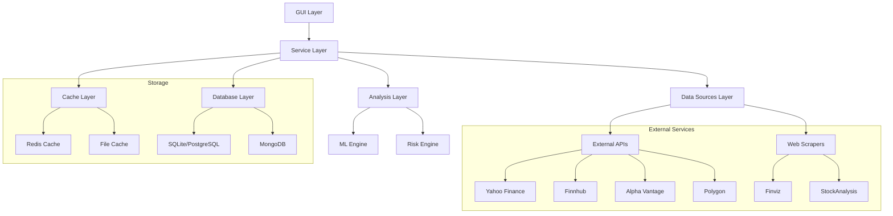
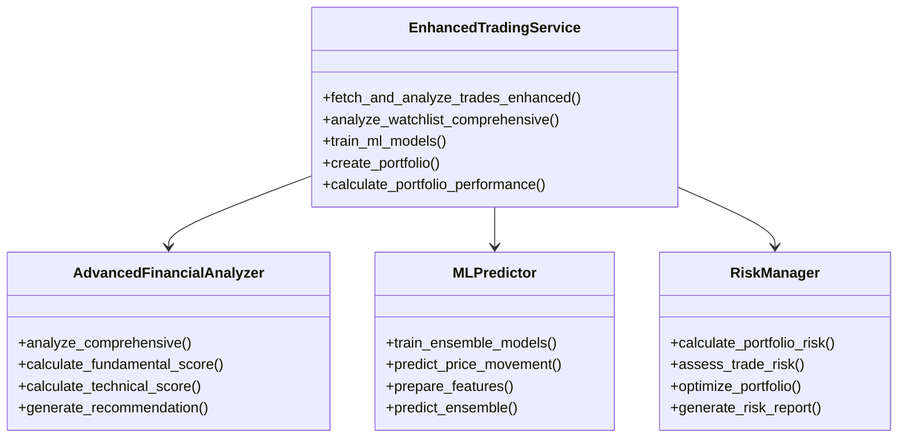
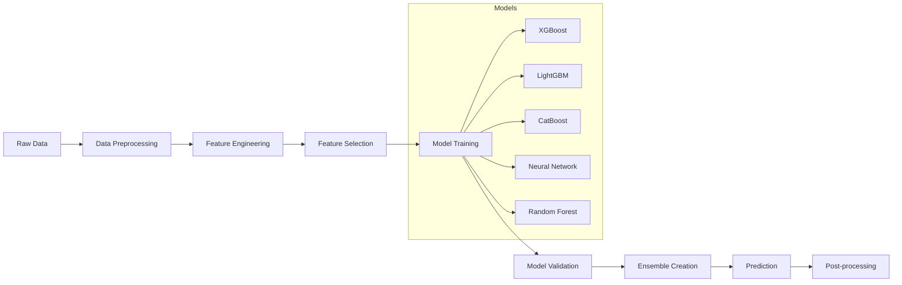

# Технічна документація - Insider Trading Monitor Pro v3.0

## 📋 Зміст

1. [Архітектура системи](#архітектура-системи)
2. [Модулі та компоненти](#модулі-та-компоненти)
3. [API та інтеграції](#api-та-інтеграції)
4. [Машинне навчання](#машинне-навчання)
5. [База даних](#база-даних)
6. [Безпека](#безпека)
7. [Розгортання](#розгортання)
8. [Моніторинг](#моніторинг)
9. [Тестування](#тестування)
10. [Troubleshooting](#troubleshooting)

## 🏗️ Архітектура системи

### Загальна архітектура



### Компонентна діаграма



## 🔧 Модулі та компоненти

### 1. Сервісний шар (Service Layer)

#### EnhancedTradingService
**Файл**: `services/enhanced_trading_service.py`

**Основні методи**:
```python
class EnhancedTradingService:
    def __init__(self):
        # Ініціалізація клієнтів та аналізаторів
        
    async def fetch_and_analyze_trades_enhanced(
        self, 
        hours_back: int = 12,
        min_amount: float = 100000,
        include_sales: bool = False,
        enable_ml_predictions: bool = True
    ) -> List[EnhancedInsiderTrade]:
        """Розширений аналіз інсайдерських торгів з ML прогнозами"""
        
    def analyze_watchlist_comprehensive(self) -> List[WatchlistItem]:
        """Комплексний аналіз watchlist з усіма джерелами даних"""
        
    def train_ml_models(self, retrain: bool = False) -> Dict[str, Any]:
        """Навчання ML моделей для прогнозування цін"""
```

**Залежності**:
- `AdvancedFinancialAnalyzer`: Фінансовий аналіз
- `MLPredictor`: Машинне навчання
- `RiskManager`: Управління ризиками
- Всі data source клієнти

### 2. Аналітичний шар (Analysis Layer)

#### AdvancedFinancialAnalyzer
**Файл**: `analysis/advanced_financial_analyzer.py`

**Ключові особливості**:
- Багатоджерельна агрегація даних
- ML-оптимізовані ваги скорування
- Комплексна система рекомендацій

```python
def analyze_comprehensive(
    self, 
    trade: EnhancedInsiderTrade,
    market_data: Dict[str, Any],
    historical_data: Optional[pd.DataFrame] = None
) -> EnhancedInsiderTrade:
    """
    Комплексний аналіз з 9 етапами:
    1. Фундаментальний аналіз
    2. Технічний аналіз  
    3. Сентимент аналіз
    4. Інсайдерський аналіз
    5. ML прогнози
    6. Оцінка ризиків
    7. Композитне скорування
    8. Генерація рекомендацій
    9. Розрахунок справедливої вартості
    """
```

#### MLPredictor
**Файл**: `analysis/ml_predictor.py`

**Архітектура ансамблю**:
```python
ensemble_models = {
    'xgboost': {'weight': 0.25, 'type': 'gradient_boosting'},
    'lightgbm': {'weight': 0.25, 'type': 'gradient_boosting'},
    'catboost': {'weight': 0.20, 'type': 'gradient_boosting'},
    'neural_network': {'weight': 0.20, 'type': 'deep_learning'},
    'random_forest': {'weight': 0.10, 'type': 'ensemble'}
}
```

**Feature Engineering (200+ ознак)**:
- Цінові ознаки (20+)
- Технічні індикатори (60+)
- Об'ємні ознаки (20+)
- Волатильність (20+)
- Моментум (20+)
- Паттерни (20+)
- Мікроструктура ринку (40+)

#### RiskManager
**Файл**: `analysis/risk_manager.py`

**Метрики ризику**:
```python
risk_metrics = {
    'var_95': 'Value at Risk (95%)',
    'var_99': 'Value at Risk (99%)',
    'expected_shortfall_95': 'Expected Shortfall (95%)',
    'expected_shortfall_99': 'Expected Shortfall (99%)',
    'max_drawdown': 'Максимальна просадка',
    'volatility': 'Річна волатильність',
    'sharpe_ratio': 'Коефіцієнт Шарпа',
    'sortino_ratio': 'Коефіцієнт Сортіно',
    'concentration_risk': 'Ризик концентрації',
    'liquidity_risk': 'Ризик ліквідності'
}
```

### 3. Шар джерел даних (Data Sources Layer)

#### Базовий клієнт
**Файл**: `data_sources/base_client.py`

```python
class BaseDataClient(ABC):
    def __init__(self, name: str, base_url: str = None):
        self.name = name
        self.base_url = base_url
        self.session: Optional[aiohttp.ClientSession] = None
        
    async def __aenter__(self):
        """Async context manager для управління сесіями"""
        
    @async_rate_limit()
    async def _make_request(self, url: str, params: Dict = None):
        """HTTP запит з обробкою помилок та rate limiting"""
        
    @abstractmethod
    async def fetch_stock_data(self, ticker: str) -> Dict[str, Any]:
        """Абстрактний метод для отримання даних"""
```

#### Спеціалізовані клієнти

**YahooFinanceClient**: Основні ринкові дані
**FinnhubClient**: Розширені фінансові метрики (ручний режим)
**WebScraperClient**: Finviz та StockAnalysis
**AlphaVantageClient**: Додаткові фінансові дані
**PolygonClient**: Інституційні дані

### 4. GUI шар

#### EnhancedMainWindow
**Файл**: `gui/enhanced_main_window.py`

**Нові вкладки v3.0**:
- 🤖 ML Прогнози
- 💼 Портфель
- ⚠️ Ризики
- 🔔 Сповіщення
- 📊 Бектестинг
- 📋 Дашборд
- 📰 Новини

**Розширені компоненти**:
```python
# Нові фрейми
PortfolioFrame: Управління портфелями
AlertsFrame: Система сповіщень
MLPredictionFrame: ML прогнози
RiskManagementFrame: Аналіз ризиків
BacktestingFrame: Бектестинг стратегій
DashboardFrame: Інтерактивний дашборд
NewsFrame: Новини та сентимент
```

## 🔌 API та інтеграції

### Зовнішні API

#### 1. Yahoo Finance (yfinance)
```python
# Безкоштовний, основні дані
data_types = [
    'info',           # Основна інформація
    'history',        # Історичні ціни
    'financials',     # Фінансові звіти
    'recommendations' # Рекомендації аналітиків
]
```

#### 2. Finnhub API
```python
# Платний, розширені дані
endpoints = {
    'company_profile': '/stock/profile2',
    'basic_financials': '/stock/metric',
    'price_target': '/stock/price-target',
    'news_sentiment': '/news-sentiment',
    'insider_transactions': '/stock/insider-transactions'
}

# Rate limits: 60 calls/minute (free), 300 calls/minute (paid)
```

#### 3. Alpha Vantage API
```python
# Платний, технічні індикатори
functions = [
    'OVERVIEW',           # Огляд компанії
    'RSI',               # Relative Strength Index
    'MACD',              # MACD індикатор
    'BBANDS',            # Bollinger Bands
    'TIME_SERIES_DAILY'  # Денні дані
]

# Rate limits: 5 calls/minute (free), 75 calls/minute (paid)
```

#### 4. Polygon.io API
```python
# Платний, інституційні дані
endpoints = {
    'tickers': '/v3/reference/tickers',
    'financials': '/vX/reference/financials',
    'market_status': '/v1/marketstatus/now',
    'aggregates': '/v2/aggs/ticker'
}

# Rate limits: 5 calls/minute (free), 1000+ calls/minute (paid)
```

### Веб-скрапінг

#### Finviz
```python
# Безкоштовний скрапінг
scraped_data = [
    'Target Price',    # Цільова ціна
    'RSI (14)',       # RSI індикатор
    'Perf YTD',       # Річна ефективність
    'P/E',            # P/E коефіцієнт
    'ROE',            # Return on Equity
    'Debt/Eq'         # Борг/Капітал
]

# Rate limiting: 30 requests/minute
```

#### StockAnalysis
```python
# Безкоштовний скрапінг
scraped_data = [
    'Price Target',        # Цільова ціна
    'Current Price',       # Поточна ціна
    'P/E Ratio',          # P/E коефіцієнт
    'Return on Equity',   # ROE
    'Debt / Equity'       # Борг/Капітал
]

# Rate limiting: 20 requests/minute
```

### Rate Limiting

#### Конфігурація
```python
# settings.py
REQUESTS_PER_MINUTE = 60
MAX_CONCURRENT_REQUESTS = 10

# Специфічні ліміти для сервісів
rate_limits = {
    'finnhub': 60,        # calls/minute
    'alpha_vantage': 5,   # calls/minute
    'polygon': 5,         # calls/minute
    'finviz': 30,         # calls/minute
    'stockanalysis': 20,  # calls/minute
    'openinsider': 30     # calls/minute
}
```

#### Реалізація
```python
@async_rate_limit()
async def _make_request(self, url: str, params: Dict = None):
    """Декоратор для rate limiting"""
    
class RateLimiter:
    def __init__(self, calls_per_minute: int):
        self.throttler = Throttler(rate_limit=calls_per_minute, period=60)
    
    async def async_wait_if_needed(self, service_name: str):
        async with self.throttler:
            logger.debug(f"Rate limited request for {service_name}")
```

## 🤖 Машинне навчання

### Архітектура ML Pipeline



### Feature Engineering

#### 1. Цінові ознаки
```python
def create_price_features(data: pd.DataFrame) -> List[np.ndarray]:
    features = []
    close = data['close']
    
    # Returns для різних періодів
    for period in [1, 3, 5, 10, 20, 50]:
        returns = close.pct_change(period)
        features.append(returns.fillna(0).values)
    
    # Log returns
    log_returns = np.log(close / close.shift(1))
    features.append(log_returns.fillna(0).values)
    
    # Price ratios
    features.append((close / data['open']).fillna(1).values)
    features.append((data['high'] / data['low']).fillna(1).values)
    
    return features
```

#### 2. Технічні індикатори
```python
def create_technical_features(data: pd.DataFrame) -> List[np.ndarray]:
    features = []
    close = data['close']
    high = data['high']
    low = data['low']
    
    # Moving Averages
    for period in [5, 10, 20, 50, 200]:
        if len(data) > period:
            sma = close.rolling(period).mean()
            ema = close.ewm(span=period).mean()
            
            features.append((close / sma).fillna(1).values)
            features.append((close / ema).fillna(1).values)
    
    # RSI
    delta = close.diff()
    gain = (delta.where(delta > 0, 0)).rolling(window=14).mean()
    loss = (-delta.where(delta < 0, 0)).rolling(window=14).mean()
    rs = gain / loss
    rsi = 100 - (100 / (1 + rs))
    features.append(rsi.fillna(50).values)
    
    # MACD
    ema_12 = close.ewm(span=12).mean()
    ema_26 = close.ewm(span=26).mean()
    macd = ema_12 - ema_26
    signal = macd.ewm(span=9).mean()
    features.append(macd.fillna(0).values)
    features.append(signal.fillna(0).values)
    
    return features
```

#### 3. Волатильність
```python
def create_volatility_features(data: pd.DataFrame) -> List[np.ndarray]:
    features = []
    close = data['close']
    high = data['high']
    low = data['low']
    
    # Historical volatility
    returns = close.pct_change()
    for period in [5, 10, 20, 50]:
        vol = returns.rolling(period).std()
        features.append(vol.fillna(0).values)
    
    # True Range and ATR
    tr1 = high - low
    tr2 = abs(high - close.shift())
    tr3 = abs(low - close.shift())
    true_range = pd.concat([tr1, tr2, tr3], axis=1).max(axis=1)
    
    for period in [14, 21]:
        atr = true_range.rolling(period).mean()
        features.append(atr.fillna(0).values)
    
    # Garman-Klass volatility
    gk_vol = (np.log(high/low) * np.log(high/low) - 
              (2*np.log(2)-1) * np.log(close/data['open']) * np.log(close/data['open']))
    features.append(gk_vol.fillna(0).values)
    
    return features
```

### Моделі ансамблю

#### 1. XGBoost
```python
xgb_params = {
    'n_estimators': 1000,
    'max_depth': 6,
    'learning_rate': 0.01,
    'subsample': 0.8,
    'colsample_bytree': 0.8,
    'random_state': 42,
    'objective': 'reg:squarederror',
    'eval_metric': 'rmse'
}

model = xgb.XGBRegressor(**xgb_params)
model.fit(X_train, y_train, 
          eval_set=[(X_val, y_val)],
          early_stopping_rounds=50,
          verbose=False)
```

#### 2. Neural Network
```python
def build_neural_network(input_dim: int) -> keras.Model:
    model = keras.Sequential([
        layers.Dense(256, activation='relu', input_shape=(input_dim,)),
        layers.BatchNormalization(),
        layers.Dropout(0.3),
        
        layers.Dense(128, activation='relu'),
        layers.BatchNormalization(),
        layers.Dropout(0.3),
        
        layers.Dense(64, activation='relu'),
        layers.BatchNormalization(),
        layers.Dropout(0.2),
        
        layers.Dense(32, activation='relu'),
        layers.Dropout(0.2),
        
        layers.Dense(1, activation='linear')
    ])
    
    model.compile(
        optimizer=keras.optimizers.Adam(learning_rate=0.001),
        loss='mse',
        metrics=['mae']
    )
    
    return model
```

#### 3. Ансамбль
```python
def predict_ensemble(self, X: np.ndarray) -> Tuple[float, Dict[str, float]]:
    predictions = {}
    
    # Отримання прогнозів від кожної моделі
    for model_name, model in self.models.items():
        if model_name == 'neural_network':
            pred = model.predict(X, verbose=0).flatten()[0]
        else:
            pred = model.predict(X)[0]
        predictions[model_name] = pred
    
    # Зважена комбінація
    ensemble_pred = sum(
        pred * self.model_weights.get(model_name, 0)
        for model_name, pred in predictions.items()
    )
    
    return ensemble_pred, predictions
```

### Валідація та метрики

#### Cross-Validation
```python
def time_series_cross_validation(X, y, n_splits=5):
    """Time series split для фінансових даних"""
    tscv = TimeSeriesSplit(n_splits=n_splits)
    
    scores = []
    for train_idx, val_idx in tscv.split(X):
        X_train, X_val = X[train_idx], X[val_idx]
        y_train, y_val = y[train_idx], y[val_idx]
        
        # Навчання та оцінка
        model.fit(X_train, y_train)
        pred = model.predict(X_val)
        score = r2_score(y_val, pred)
        scores.append(score)
    
    return np.mean(scores), np.std(scores)
```

#### Метрики ефективності
```python
evaluation_metrics = {
    'mse': mean_squared_error,
    'mae': mean_absolute_error,
    'r2': r2_score,
    'directional_accuracy': lambda y_true, y_pred: 
        np.mean(np.sign(y_true) == np.sign(y_pred)),
    'sharpe_ratio': lambda returns: 
        np.mean(returns) / np.std(returns) * np.sqrt(252)
}
```

## 💾 База даних

### Схема даних

#### SQLite/PostgreSQL (структуровані дані)
```sql
-- Таблиця торгів
CREATE TABLE insider_trades (
    id INTEGER PRIMARY KEY,
    date TIMESTAMP NOT NULL,
    ticker VARCHAR(10) NOT NULL,
    insider_name VARCHAR(255),
    insider_title VARCHAR(255),
    trade_type VARCHAR(20),
    amount DECIMAL(15,2),
    shares DECIMAL(15,2),
    price_per_share DECIMAL(10,2),
    current_price DECIMAL(10,2),
    composite_score DECIMAL(5,2),
    recommendation VARCHAR(20),
    created_at TIMESTAMP DEFAULT CURRENT_TIMESTAMP
);

-- Таблиця портфелів
CREATE TABLE portfolios (
    id INTEGER PRIMARY KEY,
    name VARCHAR(100) UNIQUE NOT NULL,
    description TEXT,
    total_value DECIMAL(15,2),
    created_date TIMESTAMP DEFAULT CURRENT_TIMESTAMP
);

-- Таблиця позицій
CREATE TABLE portfolio_positions (
    id INTEGER PRIMARY KEY,
    portfolio_id INTEGER REFERENCES portfolios(id),
    ticker VARCHAR(10) NOT NULL,
    quantity DECIMAL(15,2),
    average_price DECIMAL(10,2),
    current_value DECIMAL(15,2),
    updated_at TIMESTAMP DEFAULT CURRENT_TIMESTAMP
);

-- Таблиця алертів
CREATE TABLE alerts (
    id VARCHAR(50) PRIMARY KEY,
    ticker VARCHAR(10) NOT NULL,
    alert_type VARCHAR(20),
    condition VARCHAR(20),
    threshold DECIMAL(15,2),
    current_value DECIMAL(15,2),
    triggered BOOLEAN DEFAULT FALSE,
    active BOOLEAN DEFAULT TRUE,
    created_date TIMESTAMP DEFAULT CURRENT_TIMESTAMP
);
```

#### MongoDB (неструктуровані дані)
```javascript
// Колекція ринкових даних
{
  _id: ObjectId,
  ticker: "AAPL",
  date: ISODate,
  data_sources: {
    yahoo: { /* Yahoo Finance data */ },
    finnhub: { /* Finnhub data */ },
    alpha_vantage: { /* Alpha Vantage data */ },
    web_scraped: { /* Scraped data */ }
  },
  technical_indicators: {
    rsi_14: 65.2,
    macd: 0.45,
    sma_20: 150.25,
    // ... інші індикатори
  },
  ml_predictions: {
    price_1d: 152.30,
    price_7d: 155.80,
    price_30d: 162.10,
    probability_up_1d: 0.67,
    probability_up_7d: 0.58,
    probability_up_30d: 0.52
  },
  created_at: ISODate
}

// Колекція ML моделей
{
  _id: ObjectId,
  model_name: "xgboost_v1",
  model_type: "gradient_boosting",
  hyperparameters: { /* параметри моделі */ },
  performance_metrics: {
    r2_score: 0.62,
    mse: 0.0045,
    directional_accuracy: 0.68
  },
  feature_importance: [ /* важливість ознак */ ],
  training_date: ISODate,
  model_data: BinData  // Серіалізована модель
}
```

#### Redis (кеш)
```python
# Структура кешу
cache_keys = {
    'market_data': 'market:{ticker}:{source}',  # TTL: 1 hour
    'ml_predictions': 'ml:{ticker}:{model}',    # TTL: 6 hours
    'technical_indicators': 'tech:{ticker}',    # TTL: 30 minutes
    'fundamental_data': 'fund:{ticker}',        # TTL: 24 hours
    'insider_trades': 'insider:{ticker}',       # TTL: 1 hour
    'portfolio_performance': 'portfolio:{id}',  # TTL: 15 minutes
}

# Приклад використання
redis_client.setex(
    f"market:{ticker}:yahoo", 
    3600,  # 1 hour TTL
    json.dumps(market_data)
)
```

### Міграції

#### Alembic (для SQLAlchemy)
```python
# alembic/versions/001_initial_schema.py
def upgrade():
    op.create_table(
        'insider_trades',
        sa.Column('id', sa.Integer, primary_key=True),
        sa.Column('date', sa.DateTime, nullable=False),
        sa.Column('ticker', sa.String(10), nullable=False),
        sa.Column('insider_name', sa.String(255)),
        sa.Column('trade_type', sa.String(20)),
        sa.Column('amount', sa.Numeric(15, 2)),
        sa.Column('composite_score', sa.Numeric(5, 2)),
        sa.Column('recommendation', sa.String(20)),
        sa.Column('created_at', sa.DateTime, default=datetime.utcnow)
    )
    
    op.create_index('idx_ticker_date', 'insider_trades', ['ticker', 'date'])
    op.create_index('idx_recommendation', 'insider_trades', ['recommendation'])
```

## 🔒 Безпека

### API ключі

#### Зберігання
```python
# .env файл (не в git)
FINNHUB_API_KEY=your_secret_key
ALPHA_VANTAGE_API_KEY=your_secret_key

# Завантаження в коді
from dotenv import load_dotenv
load_dotenv()

api_key = os.getenv("FINNHUB_API_KEY")
if not api_key:
    raise ValueError("API key not found")
```

#### Ротація ключів
```python
class APIKeyManager:
    def __init__(self):
        self.keys = {
            'finnhub': [
                os.getenv("FINNHUB_API_KEY_1"),
                os.getenv("FINNHUB_API_KEY_2"),
                os.getenv("FINNHUB_API_KEY_3")
            ]
        }
        self.current_key_index = 0
    
    def get_key(self, service: str) -> str:
        keys = self.keys.get(service, [])
        if not keys:
            raise ValueError(f"No keys for service {service}")
        
        key = keys[self.current_key_index % len(keys)]
        return key
    
    def rotate_key(self, service: str):
        self.current_key_index += 1
```

### Валідація даних

#### Pydantic моделі
```python
class EnhancedInsiderTrade(BaseModel):
    ticker: str = Field(..., min_length=1, max_length=10, regex=r'^[A-Z]+$')
    amount: float = Field(..., ge=-1e12, le=1e12)
    current_price: Optional[float] = Field(None, ge=0, le=1e6)
    probability_up_1d: Optional[float] = Field(None, ge=0, le=1)
    
    @validator('ticker')
    def ticker_must_be_uppercase(cls, v):
        return v.upper()
    
    @validator('amount')
    def amount_must_be_reasonable(cls, v):
        if abs(v) > 1e12:
            raise ValueError('Amount too large')
        return v
```

#### Санітизація входів
```python
def sanitize_ticker(ticker: str) -> str:
    """Очищення тікера від небезпечних символів"""
    if not ticker:
        raise ValueError("Ticker cannot be empty")
    
    # Видалення небезпечних символів
    sanitized = re.sub(r'[^A-Za-z0-9.-]', '', ticker)
    sanitized = sanitized.upper()
    
    if len(sanitized) > 10:
        raise ValueError("Ticker too long")
    
    return sanitized
```

### Rate Limiting та DDoS захист

#### Захист від зловживань
```python
class RateLimitProtection:
    def __init__(self):
        self.request_counts = defaultdict(list)
        self.blocked_ips = set()
    
    def is_allowed(self, ip_address: str) -> bool:
        if ip_address in self.blocked_ips:
            return False
        
        now = time.time()
        requests = self.request_counts[ip_address]
        
        # Видалення старих запитів
        requests[:] = [req_time for req_time in requests if now - req_time < 60]
        
        if len(requests) >= 100:  # 100 запитів на хвилину
            self.blocked_ips.add(ip_address)
            return False
        
        requests.append(now)
        return True
```

## 🚀 Розгортання

### Docker

#### Dockerfile
```dockerfile
FROM python:3.11-slim

WORKDIR /app

# Встановлення системних залежностей
RUN apt-get update && apt-get install -y \
    gcc \
    g++ \
    && rm -rf /var/lib/apt/lists/*

# Копіювання requirements
COPY requirements.txt .
RUN pip install --no-cache-dir -r requirements.txt

# Копіювання коду
COPY . .

# Створення необхідних директорій
RUN mkdir -p cache logs data models exports

# Встановлення змінних середовища
ENV PYTHONPATH=/app
ENV PYTHONUNBUFFERED=1

# Відкриття порту
EXPOSE 8000

# Команда запуску
CMD ["python", "main.py"]
```

#### docker-compose.yml
```yaml
version: '3.8'

services:
  app:
    build: .
    ports:
      - "8000:8000"
    environment:
      - DATABASE_URL=postgresql://user:pass@db:5432/insider_trading
      - REDIS_URL=redis://redis:6379/0
    depends_on:
      - db
      - redis
    volumes:
      - ./data:/app/data
      - ./logs:/app/logs
      - ./cache:/app/cache
      - ./models:/app/models

  db:
    image: postgres:15
    environment:
      POSTGRES_DB: insider_trading
      POSTGRES_USER: user
      POSTGRES_PASSWORD: pass
    volumes:
      - postgres_data:/var/lib/postgresql/data
    ports:
      - "5432:5432"

  redis:
    image: redis:7-alpine
    ports:
      - "6379:6379"
    volumes:
      - redis_data:/data

  mongodb:
    image: mongo:6
    ports:
      - "27017:27017"
    volumes:
      - mongo_data:/data/db

volumes:
  postgres_data:
  redis_data:
  mongo_data:
```

### Kubernetes

#### Deployment
```yaml
apiVersion: apps/v1
kind: Deployment
metadata:
  name: insider-trading-monitor
spec:
  replicas: 3
  selector:
    matchLabels:
      app: insider-trading-monitor
  template:
    metadata:
      labels:
        app: insider-trading-monitor
    spec:
      containers:
      - name: app
        image: insider-trading-monitor:v3.0
        ports:
        - containerPort: 8000
        env:
        - name: DATABASE_URL
          valueFrom:
            secretKeyRef:
              name: app-secrets
              key: database-url
        - name: REDIS_URL
          valueFrom:
            secretKeyRef:
              name: app-secrets
              key: redis-url
        resources:
          requests:
            memory: "2Gi"
            cpu: "1000m"
          limits:
            memory: "4Gi"
            cpu: "2000m"
        volumeMounts:
        - name: data-volume
          mountPath: /app/data
        - name: models-volume
          mountPath: /app/models
      volumes:
      - name: data-volume
        persistentVolumeClaim:
          claimName: data-pvc
      - name: models-volume
        persistentVolumeClaim:
          claimName: models-pvc
```

### CI/CD Pipeline

#### GitHub Actions
```yaml
name: CI/CD Pipeline

on:
  push:
    branches: [ main, develop ]
  pull_request:
    branches: [ main ]

jobs:
  test:
    runs-on: ubuntu-latest
    steps:
    - uses: actions/checkout@v3
    
    - name: Set up Python
      uses: actions/setup-python@v4
      with:
        python-version: '3.11'
    
    - name: Install dependencies
      run: |
        pip install -r requirements.txt
        pip install pytest pytest-cov
    
    - name: Run tests
      run: |
        pytest tests/ --cov=./ --cov-report=xml
    
    - name: Upload coverage
      uses: codecov/codecov-action@v3

  build:
    needs: test
    runs-on: ubuntu-latest
    if: github.ref == 'refs/heads/main'
    
    steps:
    - uses: actions/checkout@v3
    
    - name: Build Docker image
      run: |
        docker build -t insider-trading-monitor:${{ github.sha }} .
        docker tag insider-trading-monitor:${{ github.sha }} insider-trading-monitor:latest
    
    - name: Push to registry
      run: |
        echo ${{ secrets.DOCKER_PASSWORD }} | docker login -u ${{ secrets.DOCKER_USERNAME }} --password-stdin
        docker push insider-trading-monitor:${{ github.sha }}
        docker push insider-trading-monitor:latest

  deploy:
    needs: build
    runs-on: ubuntu-latest
    if: github.ref == 'refs/heads/main'
    
    steps:
    - name: Deploy to production
      run: |
        # Deployment script
        kubectl set image deployment/insider-trading-monitor app=insider-trading-monitor:${{ github.sha }}
```

## 📊 Моніторинг

### Логування

#### Конфігурація
```python
import logging
import logging.handlers
from pathlib import Path

def setup_logging():
    logger = logging.getLogger("insider_trading_logger")
    logger.setLevel(logging.INFO)
    
    # File handler з ротацією
    file_handler = logging.handlers.RotatingFileHandler(
        'logs/insider_trading.log',
        maxBytes=10*1024*1024,  # 10MB
        backupCount=5,
        encoding='utf-8'
    )
    
    # Console handler
    console_handler = logging.StreamHandler()
    
    # Formatter
    formatter = logging.Formatter(
        '%(asctime)s - %(name)s - %(levelname)s - %(funcName)s:%(lineno)d - %(message)s'
    )
    
    file_handler.setFormatter(formatter)
    console_handler.setFormatter(formatter)
    
    logger.addHandler(file_handler)
    logger.addHandler(console_handler)
    
    return logger
```

#### Структуровані логи
```python
import structlog

structlog.configure(
    processors=[
        structlog.stdlib.filter_by_level,
        structlog.stdlib.add_logger_name,
        structlog.stdlib.add_log_level,
        structlog.stdlib.PositionalArgumentsFormatter(),
        structlog.processors.TimeStamper(fmt="iso"),
        structlog.processors.StackInfoRenderer(),
        structlog.processors.format_exc_info,
        structlog.processors.UnicodeDecoder(),
        structlog.processors.JSONRenderer()
    ],
    context_class=dict,
    logger_factory=structlog.stdlib.LoggerFactory(),
    wrapper_class=structlog.stdlib.BoundLogger,
    cache_logger_on_first_use=True,
)

logger = structlog.get_logger()

# Використання
logger.info("Trade analyzed", 
           ticker="AAPL", 
           score=85.5, 
           recommendation="Strong Buy",
           processing_time=2.3)
```

### Метрики

#### Prometheus метрики
```python
from prometheus_client import Counter, Histogram, Gauge, start_http_server

# Лічильники
trades_processed = Counter('trades_processed_total', 'Total processed trades', ['recommendation'])
api_requests = Counter('api_requests_total', 'Total API requests', ['service', 'status'])
ml_predictions = Counter('ml_predictions_total', 'Total ML predictions', ['model'])

# Гістограми
request_duration = Histogram('request_duration_seconds', 'Request duration', ['endpoint'])
ml_training_duration = Histogram('ml_training_duration_seconds', 'ML training duration')

# Gauge метрики
active_alerts = Gauge('active_alerts', 'Number of active alerts')
portfolio_value = Gauge('portfolio_value_usd', 'Portfolio value in USD', ['portfolio_name'])
cache_hit_ratio = Gauge('cache_hit_ratio', 'Cache hit ratio', ['cache_type'])

# Використання
@request_duration.time()
def analyze_trade(trade):
    trades_processed.labels(recommendation=trade.recommendation).inc()
    # ... логіка аналізу
```

#### Grafana Dashboard
```json
{
  "dashboard": {
    "title": "Insider Trading Monitor",
    "panels": [
      {
        "title": "Trades Processed",
        "type": "stat",
        "targets": [
          {
            "expr": "rate(trades_processed_total[5m])",
            "legendFormat": "{{recommendation}}"
          }
        ]
      },
      {
        "title": "API Response Times",
        "type": "graph",
        "targets": [
          {
            "expr": "histogram_quantile(0.95, rate(request_duration_seconds_bucket[5m]))",
            "legendFormat": "95th percentile"
          }
        ]
      },
      {
        "title": "ML Model Performance",
        "type": "table",
        "targets": [
          {
            "expr": "ml_model_accuracy",
            "legendFormat": "{{model}}"
          }
        ]
      }
    ]
  }
}
```

### Алерти

#### AlertManager правила
```yaml
groups:
- name: insider_trading_alerts
  rules:
  - alert: HighErrorRate
    expr: rate(api_requests_total{status="error"}[5m]) > 0.1
    for: 2m
    labels:
      severity: warning
    annotations:
      summary: "High error rate detected"
      description: "Error rate is {{ $value }} errors per second"

  - alert: MLModelAccuracyDrop
    expr: ml_model_accuracy < 0.6
    for: 5m
    labels:
      severity: critical
    annotations:
      summary: "ML model accuracy dropped"
      description: "Model {{ $labels.model }} accuracy is {{ $value }}"

  - alert: DatabaseConnectionLost
    expr: up{job="database"} == 0
    for: 1m
    labels:
      severity: critical
    annotations:
      summary: "Database connection lost"
```

## 🧪 Тестування

### Unit тести

#### Pytest конфігурація
```python
# conftest.py
import pytest
import pandas as pd
from unittest.mock import Mock, patch
from services.enhanced_trading_service import EnhancedTradingService

@pytest.fixture
def sample_trade_data():
    return {
        'date': '2024-01-15 10:30:00',
        'ticker': 'AAPL',
        'insider_name': 'John Doe',
        'insider_title': 'CEO',
        'trade_type': 'purchase',
        'amount': 1000000
    }

@pytest.fixture
def sample_market_data():
    return {
        'yahoo': {
            'info': {
                'regularMarketPrice': 150.25,
                'trailingPE': 25.5,
                'marketCap': 2500000000000
            }
        },
        'web': {
            'finviz': {
                'Target Price': 165.0,
                'RSI (14)': '65.2'
            }
        }
    }

@pytest.fixture
def mock_trading_service():
    with patch('services.enhanced_trading_service.EnhancedTradingService') as mock:
        yield mock
```

#### Тести аналізу
```python
# tests/test_financial_analyzer.py
import pytest
from analysis.advanced_financial_analyzer import AdvancedFinancialAnalyzer
from models.enhanced_models import EnhancedInsiderTrade

class TestAdvancedFinancialAnalyzer:
    
    def setup_method(self):
        self.analyzer = AdvancedFinancialAnalyzer()
    
    def test_fundamental_score_calculation(self, sample_market_data):
        """Тест розрахунку фундаментального скору"""
        fundamental_data = self.analyzer._extract_fundamental_data(
            'AAPL', 
            sample_market_data['yahoo']['info'],
            sample_market_data['web']['finviz'],
            {},
            {}
        )
        
        score = self.analyzer._calculate_fundamental_score(fundamental_data)
        
        assert 0 <= score <= 100
        assert isinstance(score, float)
    
    def test_recommendation_generation(self, sample_trade_data):
        """Тест генерації рекомендацій"""
        trade = EnhancedInsiderTrade(**sample_trade_data)
        trade.composite_score = 85.0
        
        result = self.analyzer._generate_recommendation(trade)
        
        assert 'recommendation' in result
        assert 'confidence' in result
        assert 'reasons' in result
        assert 0 <= result['confidence'] <= 1
    
    @pytest.mark.parametrize("score,expected", [
        (90, "Strong Buy"),
        (70, "Buy"),
        (50, "Hold"),
        (30, "Sell"),
        (10, "Strong Sell")
    ])
    def test_score_to_recommendation_mapping(self, score, expected):
        """Тест маппінгу скору на рекомендації"""
        trade = EnhancedInsiderTrade(
            date='2024-01-15',
            ticker='TEST',
            insider_name='Test',
            insider_title='Test',
            trade_type='purchase',
            amount=100000
        )
        trade.composite_score = score
        
        result = self.analyzer._generate_recommendation(trade)
        assert result['recommendation'].value == expected
```

#### Тести ML моделей
```python
# tests/test_ml_predictor.py
import numpy as np
import pandas as pd
from analysis.ml_predictor import MLPredictor

class TestMLPredictor:
    
    def setup_method(self):
        self.predictor = MLPredictor()
    
    def test_feature_preparation(self):
        """Тест підготовки ознак"""
        # Створення тестових даних
        dates = pd.date_range('2023-01-01', periods=200, freq='D')
        data = pd.DataFrame({
            'open': np.random.randn(200).cumsum() + 100,
            'high': np.random.randn(200).cumsum() + 102,
            'low': np.random.randn(200).cumsum() + 98,
            'close': np.random.randn(200).cumsum() + 100,
            'volume': np.random.randint(1000000, 10000000, 200)
        }, index=dates)
        
        features, targets = self.predictor.prepare_features(data, target_days=1)
        
        assert features.shape[0] > 0
        assert features.shape[1] > 50  # Мінімум 50 ознак
        assert len(targets) == features.shape[0]
        assert not np.isnan(features).any()
    
    def test_model_training(self):
        """Тест навчання моделей"""
        # Генерація синтетичних даних
        X = np.random.randn(1000, 50)
        y = np.random.randn(1000)
        
        results = self.predictor.train_ensemble_models(X, y, validation_split=0.2)
        
        assert isinstance(results, dict)
        assert len(results) > 0
        
        for model_name, metrics in results.items():
            assert 'mse' in metrics
            assert 'r2' in metrics
            assert metrics['mse'] >= 0
    
    def test_ensemble_prediction(self):
        """Тест ансамблевого прогнозування"""
        # Підготовка тестових даних
        X_test = np.random.randn(1, 50)
        
        # Мок моделей
        self.predictor.models = {
            'xgboost': Mock(predict=Mock(return_value=[0.05])),
            'lightgbm': Mock(predict=Mock(return_value=[0.03])),
            'catboost': Mock(predict=Mock(return_value=[0.04]))
        }
        self.predictor.model_weights = {
            'xgboost': 0.4,
            'lightgbm': 0.3,
            'catboost': 0.3
        }
        self.predictor.scalers = {'main': Mock(transform=Mock(return_value=X_test))}
        self.predictor.feature_selectors = {'main': Mock(transform=Mock(return_value=X_test))}
        
        ensemble_pred, individual_preds = self.predictor.predict_ensemble(X_test)
        
        assert isinstance(ensemble_pred, float)
        assert isinstance(individual_preds, dict)
        assert len(individual_preds) == 3
```

### Інтеграційні тести

```python
# tests/test_integration.py
import pytest
from services.enhanced_trading_service import EnhancedTradingService

class TestIntegration:
    
    @pytest.fixture
    def trading_service(self):
        return EnhancedTradingService()
    
    @pytest.mark.asyncio
    async def test_full_analysis_pipeline(self, trading_service):
        """Тест повного пайплайну аналізу"""
        # Мокування зовнішніх API
        with patch.multiple(
            trading_service,
            insider_scraper=Mock(),
            yahoo_client=Mock(),
            web_scraper=Mock()
        ):
            # Налаштування моків
            trading_service.insider_scraper.fetch_insider_trades.return_value = [
                Mock(
                    date=datetime.now(),
                    ticker='AAPL',
                    insider_name='Test Insider',
                    insider_title='CEO',
                    trade_type='purchase',
                    amount=1000000
                )
            ]
            
            # Запуск аналізу
            trades = trading_service.fetch_and_analyze_trades_enhanced(
                hours_back=24,
                min_amount=100000,
                enable_ml_predictions=False  # Вимкнути ML для швидкості
            )
            
            assert len(trades) > 0
            assert all(hasattr(trade, 'composite_score') for trade in trades)
            assert all(hasattr(trade, 'recommendation') for trade in trades)
    
    def test_portfolio_management_workflow(self, trading_service):
        """Тест робочого процесу управління портфелем"""
        # Створення портфеля
        portfolio = trading_service.create_portfolio(
            "Test Portfolio", 
            "Integration test portfolio"
        )
        
        assert portfolio.name == "Test Portfolio"
        assert "Test Portfolio" in trading_service.portfolios
        
        # Додавання позиції
        success = trading_service.add_position_to_portfolio(
            "Test Portfolio", 
            "AAPL", 
            100, 
            150.0
        )
        
        assert success
        assert "AAPL" in portfolio.positions
        assert portfolio.positions["AAPL"] == 100
        
        # Розрахунок ефективності
        with patch.object(trading_service, '_fetch_comprehensive_market_data') as mock_fetch:
            mock_fetch.return_value = {
                'AAPL': {
                    'yahoo': {
                        'info': {'regularMarketPrice': 155.0}
                    }
                }
            }
            
            performance = trading_service.calculate_portfolio_performance("Test Portfolio")
            
            assert 'current_value' in performance
            assert 'total_return' in performance
            assert performance['current_value'] > 0
```

### Performance тести

```python
# tests/test_performance.py
import time
import pytest
from analysis.ml_predictor import MLPredictor

class TestPerformance:
    
    def test_feature_engineering_performance(self):
        """Тест швидкості feature engineering"""
        predictor = MLPredictor()
        
        # Великий датасет
        data = pd.DataFrame({
            'open': np.random.randn(10000).cumsum() + 100,
            'high': np.random.randn(10000).cumsum() + 102,
            'low': np.random.randn(10000).cumsum() + 98,
            'close': np.random.randn(10000).cumsum() + 100,
            'volume': np.random.randint(1000000, 10000000, 10000)
        })
        
        start_time = time.time()
        features, targets = predictor.prepare_features(data)
        end_time = time.time()
        
        processing_time = end_time - start_time
        
        # Має обробляти 10k записів менше ніж за 30 секунд
        assert processing_time < 30
        assert features.shape[0] > 0
    
    def test_prediction_latency(self):
        """Тест затримки прогнозування"""
        predictor = MLPredictor()
        
        # Мок навчених моделей
        predictor.models = {
            'xgboost': Mock(predict=Mock(return_value=[0.05])),
            'lightgbm': Mock(predict=Mock(return_value=[0.03]))
        }
        predictor.model_weights = {'xgboost': 0.5, 'lightgbm': 0.5}
        predictor.scalers = {'main': Mock(transform=Mock(return_value=np.random.randn(1, 50)))}
        predictor.feature_selectors = {'main': Mock(transform=Mock(return_value=np.random.randn(1, 50)))}
        
        X_test = np.random.randn(1, 50)
        
        start_time = time.time()
        prediction, _ = predictor.predict_ensemble(X_test)
        end_time = time.time()
        
        latency = end_time - start_time
        
        # Прогноз має генеруватися менше ніж за 100ms
        assert latency < 0.1
        assert isinstance(prediction, float)
```

## 🔧 Troubleshooting

### Поширені проблеми

#### 1. API Rate Limits
```python
# Симптоми
ERROR: Rate limit exceeded for finnhub API
ERROR: 429 Too Many Requests

# Рішення
# 1. Збільшити затримки між запитами
REQUESTS_PER_MINUTE = 30  # Зменшити з 60

# 2. Використовувати кеш агресивніше
CACHE_DURATION_HOURS = 6  # Збільшити з 1

# 3. Реалізувати exponential backoff
async def make_request_with_backoff(url, max_retries=3):
    for attempt in range(max_retries):
        try:
            response = await make_request(url)
            return response
        except RateLimitError:
            wait_time = 2 ** attempt
            await asyncio.sleep(wait_time)
    raise Exception("Max retries exceeded")
```

#### 2. Memory Issues
```python
# Симптоми
MemoryError: Unable to allocate array
WARNING: High memory usage detected

# Рішення
# 1. Обробка даних по частинах
def process_large_dataset(data, chunk_size=1000):
    for i in range(0, len(data), chunk_size):
        chunk = data[i:i + chunk_size]
        yield process_chunk(chunk)

# 2. Очищення пам'яті
import gc
def cleanup_memory():
    gc.collect()
    
# 3. Використання генераторів замість списків
def generate_features(data):
    for row in data:
        yield extract_features(row)
```

#### 3. ML Model Performance
```python
# Симптоми
WARNING: Model accuracy below threshold: 0.45
ERROR: Model prediction failed

# Діагностика
def diagnose_model_performance():
    # Перевірка якості даних
    data_quality = check_data_quality()
    
    # Перевірка feature importance
    feature_importance = get_feature_importance()
    
    # Перевірка на overfitting
    train_score = model.score(X_train, y_train)
    val_score = model.score(X_val, y_val)
    
    if train_score - val_score > 0.1:
        logger.warning("Model overfitting detected")
    
    return {
        'data_quality': data_quality,
        'feature_importance': feature_importance,
        'overfitting_risk': train_score - val_score
    }

# Рішення
# 1. Перенавчання з новими даними
# 2. Feature selection
# 3. Hyperparameter tuning
# 4. Ensemble rebalancing
```

#### 4. Database Connection Issues
```python
# Симптоми
ERROR: Connection to database failed
WARNING: Database connection pool exhausted

# Рішення
# 1. Connection pooling
from sqlalchemy.pool import QueuePool

engine = create_engine(
    DATABASE_URL,
    poolclass=QueuePool,
    pool_size=10,
    max_overflow=20,
    pool_pre_ping=True,
    pool_recycle=3600
)

# 2. Retry logic
def execute_with_retry(query, max_retries=3):
    for attempt in range(max_retries):
        try:
            return execute_query(query)
        except DatabaseError as e:
            if attempt == max_retries - 1:
                raise
            time.sleep(2 ** attempt)

# 3. Health checks
def check_database_health():
    try:
        result = execute_query("SELECT 1")
        return True
    except Exception:
        return False
```

### Моніторинг та алерти

#### Health Check Endpoint
```python
from fastapi import FastAPI
from fastapi.responses import JSONResponse

app = FastAPI()

@app.get("/health")
async def health_check():
    checks = {
        'database': check_database_health(),
        'redis': check_redis_health(),
        'ml_models': check_ml_models_health(),
        'external_apis': check_external_apis_health()
    }
    
    all_healthy = all(checks.values())
    status_code = 200 if all_healthy else 503
    
    return JSONResponse(
        content={
            'status': 'healthy' if all_healthy else 'unhealthy',
            'checks': checks,
            'timestamp': datetime.utcnow().isoformat()
        },
        status_code=status_code
    )
```

#### Automated Recovery
```python
class AutoRecovery:
    def __init__(self):
        self.recovery_actions = {
            'database_connection_lost': self.reconnect_database,
            'ml_model_accuracy_low': self.retrain_models,
            'api_rate_limit_exceeded': self.switch_api_keys,
            'memory_usage_high': self.cleanup_memory
        }
    
    async def handle_issue(self, issue_type: str):
        action = self.recovery_actions.get(issue_type)
        if action:
            try:
                await action()
                logger.info(f"Successfully recovered from {issue_type}")
            except Exception as e:
                logger.error(f"Recovery failed for {issue_type}: {e}")
                await self.escalate_issue(issue_type, e)
    
    async def escalate_issue(self, issue_type: str, error: Exception):
        # Відправка алерту адміністраторам
        await send_alert(f"Critical issue: {issue_type}", str(error))
```

### Логи та діагностика

#### Structured Logging
```python
import structlog

logger = structlog.get_logger()

# Логування з контекстом
logger.info(
    "Trade analysis completed",
    ticker="AAPL",
    processing_time=2.3,
    recommendation="Strong Buy",
    confidence=0.85,
    data_sources=["yahoo", "finviz", "stockanalysis"],
    ml_enabled=True
)

# Логування помилок з трейсбеком
try:
    result = analyze_trade(trade)
except Exception as e:
    logger.error(
        "Trade analysis failed",
        ticker=trade.ticker,
        error=str(e),
        error_type=type(e).__name__,
        exc_info=True
    )
```

#### Performance Profiling
```python
import cProfile
import pstats
from functools import wraps

def profile_performance(func):
    @wraps(func)
    def wrapper(*args, **kwargs):
        profiler = cProfile.Profile()
        profiler.enable()
        
        try:
            result = func(*args, **kwargs)
            return result
        finally:
            profiler.disable()
            stats = pstats.Stats(profiler)
            stats.sort_stats('cumulative')
            
            # Логування топ функцій
            stats.print_stats(10)
    
    return wrapper

# Використання
@profile_performance
def analyze_trades_batch(trades):
    return [analyze_trade(trade) for trade in trades]
```

---

Ця технічна документація покриває всі аспекти системи Insider Trading Monitor Pro v3.0, від архітектури до розгортання та troubleshooting. Документація буде оновлюватися разом з розвитком системи.